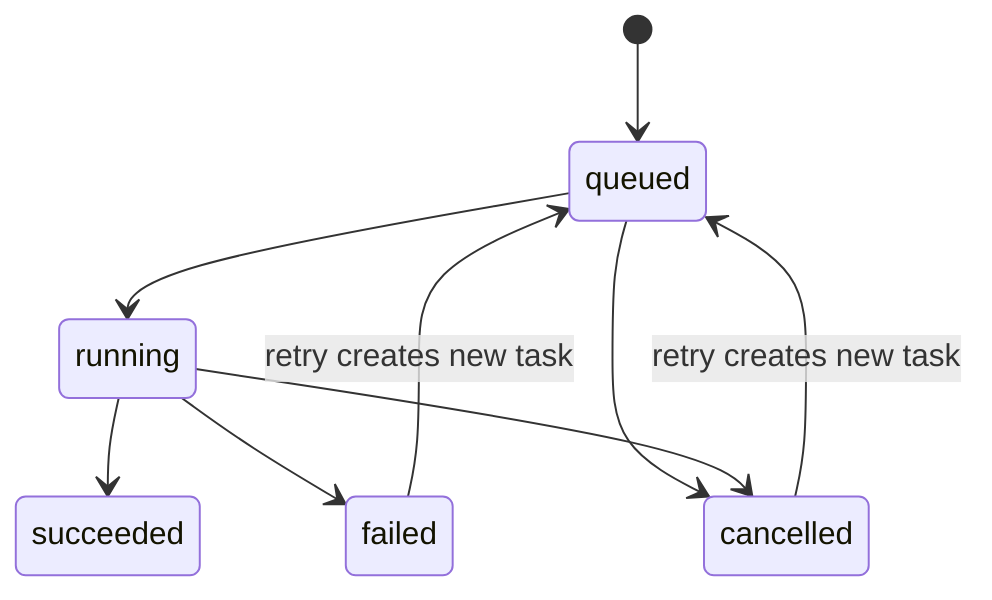

## PR-12 Assistant 可观察工作流

### 目标

PR-12 将现有 Agent worker、Backend task/artifact 事实源和阅读器 Assistant 收敛为可追踪、可控制、可恢复、可回到证据的本地工作流。第一阶段继续保持独立边界，不连接 Anki、Zotero、MinerU、MCP、浏览器插件或其他外部写入目标。

### 产品边界

| 能力 | PR-12 范围 | 后续阶段 |
|---|---|---|
| 任务可观察性 | 任务列表、详情、时间线、输入快照、运行摘要、错误 | 多 Agent 编排放到 M5 |
| 用户控制 | 取消 queued/running，重试 failed/cancelled | 跨设备调度不在第一阶段 |
| 产物 | 思维导图、Assistant 回答、结构化 JSON、文件型产物的查看与降级 | 外部导出适配器后置 |
| 证据回跳 | SourceLocator 回到原文，规范学习对象 ID 回到候选或词包 | 外部来源回跳后置 |
| 动作执行 | 受控只读动作、应用内导航与审计 | 外部软件写操作后置 |

### 数据所有权

1. PostgreSQL `agent_tasks`、任务事件和 `artifacts` 是在线事实源。
2. Desktop 本地目录只保留 worker checkpoint 与 legacy import 输入，不承担新的在线任务事实源。
3. 所有 task、event、artifact 和 action audit 必须包含 `user_id` 隔离条件。
4. 重试生成新的 task ID，并通过 retry lineage 指向原任务；旧任务、旧日志和旧产物不可被覆盖。
5. Artifact 以独立版本保存；文件缺失、版本未知或内容无法识别时返回明确的可恢复状态。

### 状态机

`succeeded`、`failed`、`cancelled` 是终态。迟到的 progress/result/error 事件不得修改终态。历史 `interrupted` 数据在兼容层显式转成可解释的失败/可重试结果，不继续作为新的公开状态。

### 接口契约

| 层级 | 操作 |
|---|---|
| Backend | 列出 task、读取 task、读取 timeline、取消、重试、列出 task artifacts、读取 artifact、记录受控 action audit |
| Tauri | `assistant_task_list_cmd`、`assistant_task_detail_cmd`、`assistant_task_timeline_cmd`、`assistant_task_cancel_cmd`、`assistant_task_retry_cmd`、`assistant_task_artifacts_cmd` |
| Frontend | `src/features/assistant` 集中管理 DTO、invoke 适配、状态展示和错误归一化 |

列表接口支持 status、article_id、limit、offset；详情和关联资源始终按当前账户过滤。时间线事件至少包含事件类型、前后状态、阶段、用户可读摘要、错误、元数据和创建时间。

### Action Registry

第一阶段允许的动作限定为应用内只读查询和导航，例如读取当前素材、列出素材、打开素材、回到原文来源或学习对象。所有动作在执行前经过注册表校验，并记录允许、拒绝、执行成功或执行失败。

以下动作在 PR-12 中明确拒绝：

1. 写入 Anki 或修改 FSRS 调度；
2. 写入 Zotero、MinerU 或其他外部应用；
3. 未登记的文件、网络、命令或第三方服务写操作；
4. 绕过用户审核直接创建正式学习卡片。

### 恢复与并发

1. Desktop 启动时读取 Backend task，再用本地 checkpoint 恢复可恢复 worker 上下文。
2. 取消必须同时更新 Backend 状态并终止/忽略对应 worker 的后续事件。
3. 重试复制原始输入快照，创建递增 attempt 的新 task，并由 Desktop 重新调度。
4. Backend 使用事务和行锁校验状态转换；重复事件必须幂等，终态不可静默改写。
5. Worker 启动热路径不得在 Tauri/Tokio async runtime 内嵌套 `block_on`；恢复只在应用启动或独立 stdout 监听线程中执行。
6. Worker 状态事件的幂等键必须包含完整 task payload 指纹，不能只依赖可能重复的 `updated_at`。
7. Worker stdout 结束时立即将仍有 checkpoint 的非终态任务收敛为失败；应用启动时将 Backend 中早于本次启动且缺少 checkpoint 的孤立 `queued/running` 任务转为可重试失败。
8. 思维导图面板同时使用实时事件和按 task ID 轮询；重新挂载时从 Backend 恢复当前素材的活动任务。

### 验收门槛

- [x] queued、running、succeeded、failed、cancelled 转换合法，终态不可被迟到事件覆盖。
- [x] failed/cancelled 可创建新 attempt，旧任务、旧事件和旧产物保持不变。
- [x] queued/running 可以取消，应用重启后状态和 checkpoint 可恢复。
- [x] 任务列表、详情、时间线、输入快照、错误和输出版本可查看。
- [x] Artifact viewer 覆盖思维导图、Assistant 回答、结构化 JSON 和缺失文件降级。
- [x] Artifact 可通过 SourceLocator 回到原文，通过学习对象 ID 回到候选或词包。
- [x] task、event、artifact 和 action audit 账户隔离测试通过。
- [x] 未登记动作和外部软件写操作被拒绝并留下审计记录。
- [x] Backend、agent-worker、Desktop、Frontend、Playwright 和 packaged smoke 全部通过。
- [x] Worker 启动不再嵌套 async runtime，worker 退出和无 checkpoint 孤立任务不会永久停留在 queued/running。
- [x] 同一 updated_at 下连续 running→succeeded 更新不会发生时间线幂等冲突。

### 验证记录

1. `bash script/verify_pr12_assistant_observability.sh --full --start-db` 在隔离 PostgreSQL 中通过 Backend、worker、Desktop 全部 Rust 集成测试、Frontend 227 项测试、生产构建和 Playwright。
2. Playwright 结果为 5 通过、2 项按运行环境条件跳过。
3. `bash script/verify_pr12_assistant_observability.sh --run-pr11` 通过 PR-11、PR-10、PR-9、PR-8 和 PR-7 回归链。
4. 0.10.0 ARM64 包执行 packaged smoke、本机 0.9.0→0.10.0 带备份覆盖升级和安装后 UI 验收。
